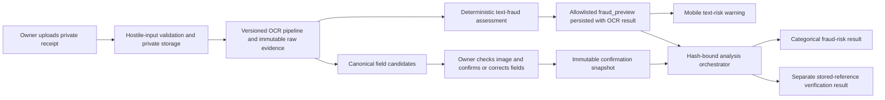

> Historical execution notice: this document is preserved for context/evidence.
> It must not select the current task. Read `FINAL_COMPLETION_OVERRIDE.md` and
> `IMPLEMENTATION_STATUS.md` first.

# Web ChatGPT Review Brief — OCR Text Risk and Receipt Review UX

## How to use this document

This is a self-contained engineering review brief for the current MoMo-FDVS
repair branch. Please review the implemented work and return evidence-based
feedback. Treat this brief as context, not as authority to override the
repository's source-of-truth specifications.

Review target:

- Repository: `davidagyekum/momo-fraud-detection`
- Branch: `codex/audit-fix-40-ocr-text-risk`
- Repair base: `447e7be6ed355716f007023503f1cfcf5ddd19ac`
- Implemented head before this review brief:
  `97598259cf0ea3b3477359df4da4ee56723cf9fb`
- Prepared: `2026-08-17`, Africa/Lagos
- Scope: deterministic OCR-text fraud evidence, analysis-policy integration,
  mobile warning UI, and the subsequent live-user OCR review-form repair

The attached user screenshots were used only to diagnose the workflow. This
document intentionally contains no phone number, person name, transaction
reference or other private value from those screenshots.

## What feedback is requested

Please inspect the named source files and specifications, then identify:

1. correctness, security, privacy, accessibility or contract defects;
2. specification mismatches, clearly separated from optional improvements;
3. missing edge cases and tests;
4. any change that needs a new version, migration or compatibility decision;
5. whether the current receipt-review flow asks the user for the minimum
   necessary information without allowing guessed evidence; and
6. whether a separate text-risk-only path should be designed for screenshots
   that cannot provide all stored-reference verification fields.

Do not assume a live mobile-network-operator integration. The prototype compares
against stored/imported reference transactions only.

## Governing requirements

When documents disagree, review against this order:

1. `00_SOURCE_OF_TRUTH_AND_SCOPE.md`
2. `02_SYSTEM_REQUIREMENTS_SPECIFICATION.md`
3. `05_API_CONTRACT.md`
4. `04_DATABASE_AND_STORAGE_SPEC.md`
5. `07_OCR_IMAGE_ML_VERIFICATION_SPEC.md`
6. `06_UI_UX_IMPLEMENTATION_SPEC.md`
7. `08_SECURITY_PRIVACY_AUDIT_SPEC.md`
8. `docs/plans/MoMo_Fraud_Detection_PR10_PR20_Colab_Blueprint.md`
9. `01_CODEX_MASTER_IMPLEMENTATION_PLAN.md`
10. `backlog.csv`
11. existing implementation

The relevant compatibility decision is `ADR-040` in `DECISION_LOG.md`.

### Non-negotiable product invariants

- Fraud risk and transaction verification are separate values, UI blocks and
  records.
- Verification is against stored/imported references, never presented as live
  MNO verification.
- Automated OCR/model/rule output is immutable evidence. Human review creates a
  confirmation or correction record; it does not overwrite raw evidence.
- A rule score is not a model probability.
- The current overall analysis score remains `null`; the product exposes a
  categorical risk band with reasons.
- A no-match text assessment is not proof that a message is genuine.
- Missing accepted image or structured models must produce an explicit
  degraded/`PARTIAL` analysis state, not a fake success.
- Raw receipts remain private and are never served from a public static path.
- Historical OCR results are replayed from persisted evidence and are not
  silently recomputed under a changed ruleset.

## Why this repair was started

The replacement implementation package was:

- source file: `MoMo_OCR_Obvious_Fraud_Implementation_Package.zip`;
- SHA-256:
  `9b05450025363e1bde86e423dd685fbf5f5b00a191597a020a2a64d62f06fb57`;
- manifest verification: all 34 listed files matched.

The package was treated as technical reference, not as a new source of product
requirements. Its proposed final-risk overlay conflicted with the repository's
existing categorical, null-score, hash-bound risk policy and separate
verification contract. It was therefore reconciled through `ADR-040` instead
of being copied wholesale.

## Implemented end-to-end behavior



The text assessment is available immediately after OCR so the user can see a
warning before canonical transaction fields are confirmed. Final analysis still
requires the established confirmation flow and preserves separate verification.

## Deterministic text-fraud assessment

### Version identities

- Assessment schema: `momo-text-fraud-assessment-v1`
- Ruleset: `ghana-momo-obvious-scam-rules-v1`
- Analysis policy: `analysis-risk-policy-demo-v2`
- Policy artifact SHA-256:
  `1792dc73da11782c82a05a1e4e7a8f1cc585f4e8e99111b6a30e9ed220cc51b4`

Primary implementation:

- `services/api/src/momo_fdvs/services/text_fraud.py`
- `services/api/src/momo_fdvs/services/ocr.py`
- `services/api/src/momo_fdvs/services/analysis_orchestrator.py`
- `services/api/src/momo_fdvs/services/risk_policy.py`
- `services/api/src/momo_fdvs/policies/risk_policy_demo_v1.json`

The policy file retains its established packaged filename for compatibility;
its contents identify the active versioned policy.

### Supported rule families

The high-precision rules look for bounded combinations rather than isolated
words. Current reason families include:

- PIN, OTP or secret-code disclosure requests;
- wrong-transfer/refund lures coupled with a requested action;
- account block, suspension or closure threats coupled with an external action;
- demands to pay or transfer money to unlock an account;
- suspicious links coupled with account or credential action;
- redirection to unverified phone/WhatsApp/contact channels;
- prize/reward lures coupled with a requested action; and
- urgency/pressure used as supporting scam evidence.

Unofficial sender context can support a finding but is not alone decisive.
Negated official advisories such as “do not share your PIN” are excluded from
the disclosure-request rule so a safety warning is not itself labelled fraud.

### Output and privacy boundary

The persisted/client-visible `fraud_preview` is allowlisted. It can contain
version identifiers, availability/status, categorical class, bounded rule
score, `score_is_probability=false`, safe reason codes and safe explanatory
copy. It must not contain:

- the raw OCR text;
- matched secret text;
- a phone number, URL, account identifier or transaction value extracted from
  the receipt; or
- an internal regex match or unbounded diagnostic string.

Raw OCR text remains protected technical evidence under existing ownership
rules. The safe preview is persisted and replayed so historical results are not
silently changed when rules evolve.

## Integration with final fraud risk

The analysis orchestrator projects the text assessment into the existing
`SEMANTIC_RULES` stage. The policy consumes categorical evidence and reason
codes, not a fabricated probability. High-confidence deterministic evidence can
raise the categorical review band, but:

- `overall_score` remains `null`;
- verification status is computed independently;
- text no-match does not set `GENUINE`;
- unavailable image/structured models remain visible and keep the overall run
  `PARTIAL`; and
- the stored model/version/threshold/reason evidence remains immutable.

The API changes are additive and the OpenAPI snapshot was regenerated and
verified. No database schema or migration was added because the preview fits the
existing versioned OCR/analysis JSON evidence boundary.

## Mobile warning UI

Primary files:

- `apps/mobile/src/components/text-fraud-risk-card.tsx`
- `apps/mobile/src/components/__tests__/text-fraud-risk-card.test.tsx`
- `apps/mobile/src/app/ocr/[transactionId].tsx`
- `apps/mobile/src/lib/ocr-client.ts`

The card displays textual status and reasons, not color alone. It distinguishes
high risk, suspicious, no decisive signal and unavailable assessment. The copy
states that a rule match is a warning, not live network verification or a legal
determination. A no-decisive-signal state explicitly does not certify that the
transaction is genuine.

## What live user testing exposed

The first implementation of the OCR review form was technically strict but
unnecessarily burdensome and, for one common path, misleading:

1. Every value absent from OCR was treated as if the user had corrected OCR.
2. Each changed or manually entered field generated a required free-text
   “reason for changing” box.
3. Required transaction fields and optional party details had equal visual
   priority.
4. The API returned safe field-specific errors, but the mobile `ApiError`
   discarded them, leaving only “review highlighted OCR fields.”
5. The client silently inserted `GHS` when OCR had not detected currency. This
   undocumented value then appeared as a correction without an accompanying
   reason, which could trigger the generic server rejection.
6. The parser did not recognise a bounded standalone `ID-...` reference or the
   legacy `GHC` amount notation present in common SMS-style receipts.

The screenshots that revealed this were diagnostic evidence only. Their private
contents were not copied into tests, fixtures, documentation or Git history.

## Implemented receipt-review UX repair

### Manual entry versus correction

- If OCR produced a value and the owner changes it after checking the image,
  the confirmation records a correction.
- If OCR produced no value, a user-entered value is a manual entry, not a claim
  that OCR made an error.
- Correction reasons are bounded system-generated audit descriptions after the
  user confirms that the private image was reviewed. The user no longer types
  arbitrary prose for every field.
- The raw OCR output is still immutable; the confirmed snapshot remains
  separate evidence.

### Required and optional fields

The form now separates the fields needed for the existing stored-reference
comparison from optional context. Optional sender/receiver identity and phone
fields may remain blank. The interface explicitly tells the user not to invent
or guess missing values.

A screenshot that genuinely lacks a canonical transaction reference, amount,
currency, date/time or receipt status may therefore be unsuitable for the
stored-reference comparison even though its text-risk preview is still useful.
The present implementation does not fabricate those values to force analysis.

### Validation and recoverability

- Client validation checks reference format/length, amount, names, receipt
  status and optional Ghana phone formats before submission.
- Safe server `field_errors` are preserved on `ApiError` and mapped to the exact
  form inputs.
- The error summary and inline errors use alert/live semantics.
- Missing OCR currency remains blank unless OCR extracted it or the user entered
  it; there is no hidden `GHS` default.

Primary files:

- `apps/mobile/src/app/ocr/[transactionId].tsx`
- `apps/mobile/src/lib/ocr-client.ts`
- `apps/mobile/src/lib/api.ts`
- `apps/mobile/src/types/api.ts`
- `apps/mobile/src/lib/__tests__/ocr-client.test.ts`
- `apps/mobile/src/lib/__tests__/api.test.ts`

## Parser repair

The canonical parser now supports bounded standalone `ID-...` references and
legacy `GHC` amount notation. Patterns are bounded to avoid treating arbitrary
prose as a reference or amount. Regression tests use wholly fictitious data.

Files:

- `services/api/src/momo_fdvs/services/ocr.py`
- `services/api/tests/unit/test_ocr_pipeline.py`

This is a deterministic parser compatibility repair, not OCR-model training and
not an accuracy claim. Previously persisted OCR results are not recomputed.

## Contract and documentation changes

The repair updated:

- `05_API_CONTRACT.md`
- `06_UI_UX_IMPLEMENTATION_SPEC.md`
- `07_OCR_IMAGE_ML_VERIFICATION_SPEC.md`
- `08_SECURITY_PRIVACY_AUDIT_SPEC.md`
- `packages/api-client/openapi.json`
- `requirements_traceability.csv`
- `DECISION_LOG.md` (`ADR-040`)
- `IMPLEMENTATION_STATUS.md`
- `CHANGELOG.md`

No endpoint was removed and no existing enum or database column was replaced.
No database migration, data backfill, model fit, locked-test access, accuracy,
F1, production-deployment or GitHub-CI claim was introduced.

## Verification evidence

### Current gates after the UX repair

| Gate | Measured result |
|---|---|
| Backend complete gate | PASS — 214 tests, 85.87% branch-aware coverage; format, lint, strict typing, OpenAPI and ER checks pass |
| Mobile complete gate | PASS — 69 tests, 83.78% statement and 71.04% branch coverage; format, lint, typecheck and 28-route export pass |
| Focused mobile API/OCR tests | PASS — 16/16 |
| Focused parser regression | PASS — 1/1, with seven unrelated tests deselected and coverage disabled for the focused run |
| Impeccable mechanical UI detector | PASS — `[]` |
| Secret/prohibited-artifact scan | PASS — 643 candidate files |

The exact evidence and commands are recorded in:

- `docs/evidence/OCR_TEXT_FRAUD_REPAIR.md`
- `docs/handoffs/2026-08-17-ocr-text-risk-repair.md`
- `docs/handoffs/2026-08-17-ocr-review-usability-repair.md`

### Earlier regression evidence not rerun for the bounded UX follow-up

- Administrator: 40 tests, three Playwright flows and production build.
- ML: 714 tests; no training executed.
- Backend security: 31 PostgreSQL-backed scenarios.
- Controlled end-to-end journey: API, mobile assertions and administrator flows.
- A current-source container demonstration with Tesseract `5.3.0` classified
  the package's wholly fictitious obvious-scam sample as `FRAUDULENT`, score
  `95`, `score_is_probability=false`, with safe reason codes only.

These are regression/demonstration results, not estimates of real-world model or
rule accuracy.

## Current runtime blocker

The dedicated local release previously ran at:

- mobile: `http://localhost:8084`;
- API: `http://localhost:8003`;
- administrator portal: `http://localhost:5177`;
- PostgreSQL host port: `55436`; and
- Compose project: `momo-fdvs-text-risk`.

Updated API/mobile images built, but Docker Desktop's internal Linux
overlay/containerd metadata became read-only during API recreation. Docker then
returned HTTP 500 and its `docker-desktop` WSL distribution did not recover
after a non-destructive restart. Restarting the required Windows services needs
administrator rights.

No Docker reset, data purge or volume deletion was attempted because that could
destroy this and unrelated local data. The updated four-service stack is not
claimed running. Safe next action: reboot Windows or restart WSL/VM Compute as
administrator, confirm volumes remain intact, then recreate and probe only the
named Compose project.

## Known limitations and separate issues

1. The text rules deliberately favor bounded/high-precision combinations. An
   account-block or PIN mention with no requested action may produce “no
   decisive signal.” Whether provider impersonation plus threat language should
   become `SUSPICIOUS` needs a new versioned rule decision and tests; the current
   ruleset must not change silently.
2. An SMS-style screenshot without all canonical reference fields can show the
   text-risk preview but cannot complete the current stored-reference comparison
   without truthful user input. A text-risk-only analysis path would be a
   product/API workflow decision, not a UI shortcut.
3. Missing accepted image and structured model artifacts intentionally keep
   full analysis `PARTIAL`.
4. There is no live MNO verification.
5. `flask db check` reports a pre-existing PR19 constraint-name mismatch:
   database `ck_report_artifacts_ck_report_artifacts_source_version_positive`
   versus model metadata `ck_report_artifacts_source_version_positive`. This
   schema-neutral repair did not rewrite an applied migration.
6. The all-section wrapper remains non-zero for host-tool mismatch: installed
   Node.js/npm differ from repository pins and host Tesseract is absent. The
   applicable backend/mobile product gates above passed in their supported
   environments.

## Questions for the reviewer

Please answer these explicitly:

1. Do the rule combinations and negation handling adequately reduce false
   positives while covering obvious Ghana MoMo social-engineering patterns?
2. Should provider-impersonation plus blocked-account/PIN language without an
   explicit action be a versioned `SUSPICIOUS` rule, or is the present
   high-precision no-match behavior preferable?
3. Is the boundary between immutable OCR evidence, manual entry, correction and
   automatic audit reason clear and defensible?
4. Are the required stored-reference fields correct for the existing contract,
   and are optional sender/receiver details given appropriately lower priority?
5. Should the product add a text-risk-only workflow that can finish with
   verification `UNVERIFIED` when canonical receipt fields are unavailable? If
   yes, identify the API/schema/audit/versioning changes rather than suggesting
   that the client bypass current validation.
6. Is persisting the safe preview in existing versioned JSON evidence sufficient,
   or is a separate normalized record justified? State the migration and replay
   implications of changing this.
7. Are the allowlist and safe `field_errors` boundaries strong enough to prevent
   private OCR contents from reaching logs, client errors or public responses?
8. Which security, accessibility, parser-boundary or replay/idempotency tests are
   still missing?
9. Is there a safer or clearer approach to Docker image dependency caching and
   recreation that would reduce local rebuild pressure without changing the
   product stack?

## Requested response format

Return findings first, ordered by severity:

- `P0`: security/data-loss/release-blocking;
- `P1`: likely correctness, privacy or contract failure;
- `P2`: important edge case, accessibility or maintainability weakness; and
- `P3`: optional polish.

For every finding:

1. cite the relevant repository file and line or this brief's section;
2. show the failing scenario and why existing tests do not cover it;
3. distinguish a source-of-truth violation from an optional improvement;
4. state whether it requires a version, migration or compatibility decision;
5. propose the smallest safe correction and a concrete regression test; and
6. avoid claims based only on preference or on private screenshot contents.

After findings, include:

- open questions/assumptions;
- an assessment of the current test evidence;
- a prioritized next-action list; and
- “No actionable findings” if the inspected code supports that conclusion.

## Recommendations that would conflict with scope

Please do not recommend any of the following without explicitly identifying a
source-of-truth change and migration plan:

- replacing Flask, PostgreSQL, Expo/React Native, React/Vite or the selected ML
  stack;
- treating the rule score as a calibrated probability;
- merging fraud risk and verification into one field;
- claiming live MNO confirmation;
- silently recomputing historical OCR evidence;
- returning fake success when integrations/models are missing;
- copying real screenshot values into fixtures or public documentation;
- serving raw receipts from a public static path; or
- resetting/purging Docker data as a routine recovery step.

## Relevant commit sequence

```text
447e7be fix(analysis): package release risk policy
11f8278 feat(ocr): add obvious scam text risk
04018f8 docs(handoff): finalize OCR text risk evidence
9759825 fix(ocr): simplify receipt review corrections
```

The review should focus on the diff from
`447e7be6ed355716f007023503f1cfcf5ddd19ac` through the current branch head,
while using the governing documents above as the specification.
